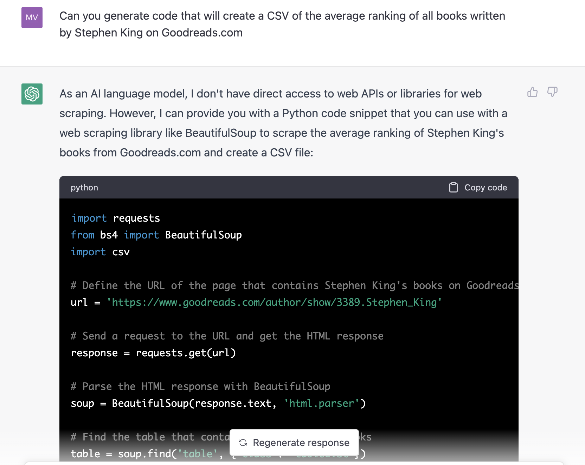

# stephen-king-book-ratings
## Introduction
Stephen King is the author of 70+ horror novels and short story collections, but not all have been equally beloved by the public. Many horror aficionados prefer "vintage" Stephen King (1980s) to his more recent work. Some people say that nothing can top classics like The Shining, It, Misery, or The Stand. Has the quality of Stephen King's books decreased in recent years?

One might predict that factors like aging, becoming extremely wealthy and no longer needing to work very hard in life, or being so famous that your editors are too afraid to give too much criticism, might mean Stephen King's later works are have been lower in quality and so less well received by the public. But is this the case? Additionally, Stephen King has mentioned coming clean from a drug addiction after he wrote The Tommyknockers. Can we see if this had any effects on his work by comparing the average rating of his books written before The Tommyknockers and after The Tommyknockers?

To investigate this, I wrote a simple web scraper and plotting script.

As a measure for the quality of Stephen King's books, I used their average ratings on Goodreads.com. On Goodreads, users rate books between 1 and 5 stars, with 5 being the best possible rating, and 1 being the worst. (Note that the average Goodreads rating is not necessarily an accurate measure of book quality, as Goodreads users do not always appear to have great taste, and have rated The Tommyknockers incorrectly low, and The Green Mile inappropriately high).

## Instructions for running code
This code builds a CSV of Stephen King's bibliography of novels and short story collections from his Wikipedia page, then uses that list to build another CSV of Stephen King's books' titles, average ratings, and years published.

To generate the two CSV files and two plot files, run `main.py`.

## Conclusion 

A linear regression (and visual inspection) of the scatterplot of the average Goodreads ratings of Stephen King's books by year shows his work quality has apparently not decreased with age, at least according to Goodreads users.

<iframe src="https://your-html-file-url"></iframe>

    

Future work might entail looking at the reception of his books among newspaper book reviewers.

## Acknowledgements

ChatGPT wrote the first version of this code (see the first commit). The code, while impressively close to working, did not actually work.

